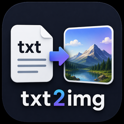
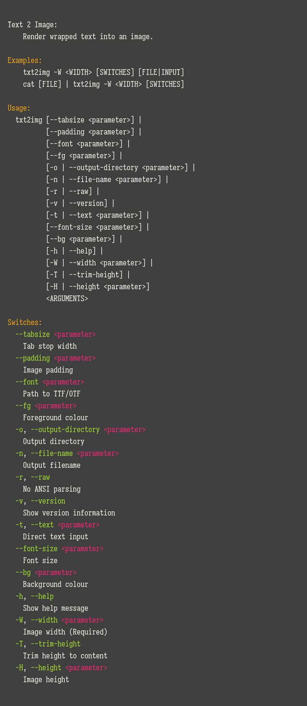
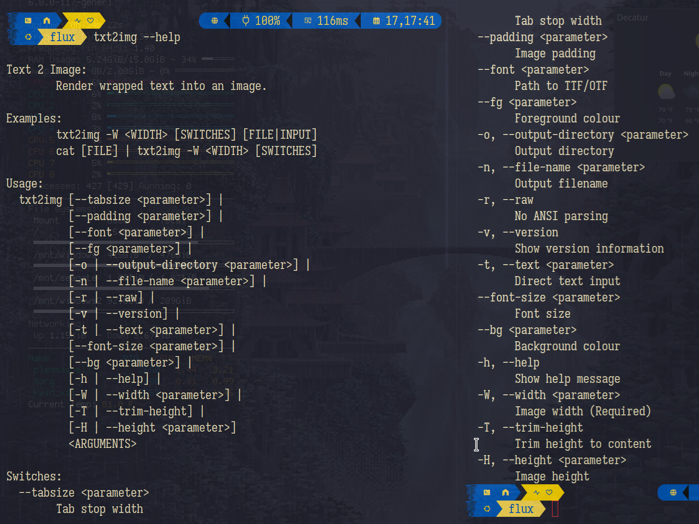

# Text 2 Image  

[](https://github.com/Pranesh-2005/github-readme-stats)

---

## About

Text 2 Image is a lightweight, cross-platform command-line utility designed for rendering wrapped text into image files. Built with modern C++ and leveraging the `FreeType` library, it provides a powerful interface for converting text (including ANSI-styled text) into high-quality images.

### Description

Text 2 Image offers a comprehensive set of features for text-to-image rendering, including:

- **ANSI Style Support**: Render text with colors, bold, and italic styles using standard ANSI escape codes.
- **Word Wrapping**: Automatically wrap text to a specified width for consistent layout.
- **Multi-page Output**: Support for rendering long text into multiple image pages with fixed height.
- **Customizable Aesthetics**: Control width, height, padding, font size, and background/foreground colors.
- **Cross-Platform Font Discovery**: Automatically locates usable fonts on Windows, macOS, and Linux.
- **UTF-8 Support**: Full support for multi-byte UTF-8 characters.

The utility is designed for developers, system administrators, and power users who need a script-friendly way to generate visual representations of terminal output or documents.

### Motivation

While many tools can convert text to images, few provide a simple, scriptable interface that preserves terminal styling (ANSI codes) and handles complex layouts like word wrapping and multi-paging. This project was born out of the need to:

- Generate "screenshots" of terminal output for documentation or social media.
- Automate the creation of text-based assets for various applications.
- Provide a lightweight tool for developers to integrate text rendering into their pipelines.
- Maintain high code quality and portability using modern C++ standards.

Text 2 Image aims to be the go-to CLI tool for high-quality text-to-image conversion.

---

## Build

If you'd like to build this yourself, ensure you have the following requirements installed:

- **C++20 compatible compiler** (GCC 10+, Clang 10+, or MSVC 2019+)
- **CMake 3.16 or higher**
- **FreeType library**

### Installation of Dependencies

**Ubuntu/Linux:**
```bash
sudo apt-get update && sudo apt-get install -y libfreetype-dev
```

**macOS:**
```bash
brew install freetype
```

**Windows:**
It is recommended to use [vcpkg](https://github.com/microsoft/vcpkg):
```bash
vcpkg install freetype:x64-windows
```

### Compiling from Source

1. **Clone the repository:**
   ```bash
   git clone https://github.com/Lateralus138/txt2img.git
   cd txt2img
   ```

2. **Configure and Build:**
   ```bash
   cmake -B build -DCMAKE_BUILD_TYPE=Release
   cmake --build build --config Release
   ```

3. **Install (Optional):**

   By default, this will install to system-wide directories (e.g., `/usr/local` on Linux, `C:\Program Files` on Windows).

   **Install System-wide:**
   ```bash
   sudo cmake --install build
   ```

   **Install to a specific directory (e.g., `$HOME/.local`):**
   ```bash
   cmake -B build -DCMAKE_INSTALL_PREFIX=$HOME/.local
   cmake --build build --config Release
   cmake --install build
   ```

   **Install to a custom path (Windows example):**
   ```bash
   cmake -B build -DCMAKE_INSTALL_PREFIX="C:\my_tools"
   cmake --build build --config Release
   cmake --install build
   ```

---

## Usage

### Environment

Text 2 Image is designed to work across multiple operating systems with minimal dependencies:

**Supported Platforms:**
- **Windows**: Windows 10/11 (x64)
- **Linux**: Most modern distributions (x64)
- **macOS**: macOS 10.15+ (x64/ARM)

**Requirements:**
- C++20 compatible compiler (if building from source)
- CMake 3.16 or higher (if building from source)
- FreeType library

**Build Dependencies (if building from source):**
- Windows: Visual Studio 2019+ or MinGW
- Linux: GCC 7+ or Clang 6+, `libfreetype-dev`
- macOS: Xcode 10+ or Clang 6+, `freetype`

### How To Use

Text 2 Image uses a simple command-line syntax with intuitive switches and arguments.

**Basic Syntax:**
```bash
txt2img -W <WIDTH> [OPTIONS] [FILE|INPUT]
```

**Available Options:**
- `-h, --help` - Show help message
- `-v, --version` - Show the version of the utility
- `-t, --text` - Direct text input (use `\n` for newlines)
- `-W, --width` - Set the output image width (Required)
- `-H, --height` - Set the output image height (Optional, enables multi-paging)
- `-T, --trim-height` - Trim image height to content
- `-r, --raw` - Disable ANSI code parsing
- `-n, --file-name` - Set the output filename (defaults to output.png)
- `-o, --output-directory` - Set the output directory
- `--fg` - Set foreground color (hex, e.g., "#FFFFFF")
- `--bg` - Set background color (hex)
- `--font` - Path to a specific TTF/OTF font file
- `--font-size` - Set font size (default: 20)
- `--padding` - Set image padding (default: 20)
- `--tabsize` - Set tab stop width (default: 4)

### Examples

**Basic Usage:**
```bash
# Render a simple string
txt2img -W 800 -t "Hello World" -n hello.png

# Render a file with word wrapping
txt2img -W 600 input.txt
```

**Styled Output:**
```bash
# Render ANSI styled text (e.g. from a script)
./my_script.sh | txt2img -W 800 -n script_output.png

# Custom colors and font size
txt2img -W 1000 --fg "#FF0000" --bg "#000000" --font-size 24 -t "Red on Black"
```

**Advanced Usage:**
```bash
# Multi-page output with fixed height
txt2img -W 800 -H 1000 long_document.txt -n page.png

# Trim height to content
txt2img -W 800 -T -t "Compact output"

```

**Force Color using batcat**
```Bash
txt2img -h |
   batcat --language=help --style=plain --paging=never --color=always |
   txt2img -W 800 --bg '#3f3f3f' --font '/usr/share/fonts/truetype/IosevkaTermSlabNerdFontMono-Regular.ttf' -n txt2img_help.png
```
produces:


---

## Project Information

This project is written in `C++`.

[![C++](https://img.shields.io/endpoint?url=https://raw.githubusercontent.com/Lateralus138/txt2img/master/docs/json/cpp.json&logo=data%3Aimage%2Fpng%3Bbase64%2CiVBORw0KGgoAAAANSUhEUgAAABAAAAAQCAMAAAAoLQ9TAAAABGdBTUEAALGPC%2FxhBQAAACBjSFJNAAB6JgAAgIQAAPoAAACA6AAAdTAAAOpgAAA6mAAAF3CculE8AAABcVBMVEUAAAAAgM0Af8wolNQAa7YAbbkAQIcAQIYAVJ0AgM0AgM0AgM0AgM0AgM0AgM0AgM0AgM0AgM0AgM0Af8wAfswAfswAf8wAgM0AgM0AgM0Af80AgM0AgM0AgM0AgM0Af8wAgM0Af80djtIIg84Af8wAfsxYrN4Fg84Gg85RqNwej9MLhM8LhM8AfcsAgM0Hg88AfsshkNNTqd1%2Fv%2BUXi9AHdsAAYKoAY64ih8kAf81YkcEFV54GV55Sj8EnlNULhc8AecYdebwKcrsAe8gAb7oAXacAXqgAcLwAImUAUpoAVJ0AUpwAUZoAIWMAVJ0AVJ0AUpwAUZwAVJ0AVJ0AVJ0AVJ0AgM0cjtJqteGczetqtOEAf807ndjL5fT9%2Fv7%2F%2F%2F%2FM5fQ9ntnu9vu12vCi0Oz%2F%2F%2F6Hw%2Bebzeufz%2Bx%2Bv%2BW12e%2Bgz%2BxqteLu9fmRx%2BjL3Ovu8%2Fi1zeKrzeUAUpw7e7M8fLQAU50cZ6hqm8WcvNgAVJ3xWY3ZAAAAVnRSTlMAAAAAAAAAAAAREApTvrxRCQQ9rfX0qwErleyUKjncOFv%2B%2Fv5b%2Ff7%2B%2Fv7%2B%2Fv1b%2Ff7%2B%2Fv7%2BW%2F7%2B%2Fv79%2Fv7%2B%2Fv7%2B%2Fv7%2B%2Fjfa2jcBKJHqKAEEO6r0CVC8EFaOox4AAAABYktHRF9z0VEtAAAACXBIWXMAAA7DAAAOwwHHb6hkAAAAB3RJTUUH5QYKDQws%2FBWF6QAAAONJREFUGNNjYAABRkZOLkZGBhhgZOTm4eXjF4AJMQoKCYuEhYmKCQmCRBjFJSSlwiMiI6PCpaRlxBkZGGXlomNi4%2BLj4xISo%2BXkgQIKikqx8UnJyUnxKcqKKiAB1ajUJDV1Dc00LW0dXSaggF56fLK%2BgYFhhlGmsQkzRCDL1MzcIhsmYJkTn2tlbWObZ2cP0sKk4OCYH19QWFgQX%2BTkrMLEwOLiWlySD7I2v7TMzZ2Vgc3D08u7vKKysqLc28vHlx3oVg4%2F%2F4DAqqrAAH8%2FDohnODiCgkNCgoM4OOD%2B5eAIDYVyAZ9mMF8DmkLwAAAAJXRFWHRkYXRlOmNyZWF0ZQAyMDIxLTA2LTEwVDE4OjEyOjQ0LTA1OjAwkjvGQgAAACV0RVh0ZGF0ZTptb2RpZnkAMjAyMS0wNi0xMFQxODoxMjo0NC0wNTowMONmfv4AAAAASUVORK5CYII%3D)](http://www.cplusplus.org/)

### Changelog

See [Changelog](./docs/md/reference/changelog.md)

### Source File Quality

This is graded by CodeFactor and is subjective, but helps me to refactor my work.

|                                                Name                                                 |                                                                        Status                                                                        |
| :-------------------------------------------------------------------------------------------------: | :--------------------------------------------------------------------------------------------------------------------------------------------------: |
| [codefactor.io](https://www.codefactor.io/repository/github/lateralus138/txt2img) |  |

### File SHA256 Hashes

All hashes are retrieved at compile/build time.

#### Current Windows X64 SHA256


#### Current Linux X64 SHA256


#### Current Linux DEB SHA256


#### Current Linux Flatpak SHA256


#### Current macOS X64 SHA256


#### Current Debian Package SHA256


#### Current Flatpak Bundle SHA256


### Other Miscellaneous File Information

|           Description            |                                                                                Status                                                                                |
| :------------------------------: | :------------------------------------------------------------------------------------------------------------------------------------------------------------------: |
|       Project Release Date       |          |
| Total downloads for this project |       |
|     Complete repository size     |                  |
|      Commits in last month       |  |
|       Commits in last year       |  |

![](https://ghvc.kabelkultur.se?username=Lateralus138&repository=txt2img&color=2E9778&labelColor=1d1d1d&logo=data%3Aimage%2Fpng%3Bbase64%2CiVBORw0KGgoAAAANSUhEUgAAABAAAAAQCAYAAAAf8/9hAAAACXBIWXMAAAB2AAAAdgFOeyYIAAAAGXRFWHRTb2Z0d2FyZQB3d3cuaW5rc2NhcGUub3Jnm+48GgAAAzFJREFUOI19k19ME1kUxs+dO+1MB2ZKaUtpVSgOImgRWlZkdzWBVXQ1/skmazYqKolSozGbTXz33Rjj48YHY2KixhATNUaz+C+uwWiwEGUxImJRYKWUtiPMTNvpnbk+YdSI39N3kvM7L+f7ABZQZ9eRxq6uP38CANiwL1qxce+B0Lf2mM+H1s5OHgAQAIBTYK9UOen9aPTIWjIrzFICP7fv7ur8+gCaNzv2HFpR7eZ6iGUacT3b4OeE7o4Vrk1XR9KTQymyn1BzLUNRkiLm9u2LZ0bmOXbeFBgqyqUOrs7JLro+CoMvM4UtD//P3mop4xfnzdyO4TQZMix4Zsfm5o6Dh8s9PHOCgnUaAwC07op6GMNMKcQiZSIXafI6fKmc8es7ldxcs8T5g6LmGhLUPIZzZuLHuooHNotca/HYmv5LF+4wTdGoLeTmHq9ZLMRFm0V74rNnZgijbq6SljpZaL8+knmxbonTIfPctVvd55K9r97LlU67b0o3zQnNuIvfx2J0VaT5t23LvdUCtVo/5InwLKnfW+YRa2udrK8vobPNFaWCiIjHXxdpJNTK/RJ07RpXdPOtrh/HAAAo0nhxOpmtlMskeXWZICfUfPDfybmRSKDEvbGqRORZDF7JwZQLuMbO4pbGclEaT6nMSw3/jfcdPPR7uIjvYRhkxKa0CwZQeXtNqR8R4jIQVheJnDD/MIm3M7LLISIAmFZUFM/kL7MmYOwVeRTx8usfjX9oHk5nX48pRi4a8ddyGDkWClqxDUPIK7Thwf6+IaGy/p+xOaNmpa840BYoDmYLhA1IPM+xzEI8qFoW3mlkjAUANGeRYj1j/qXk80GvwB/fWu1ukDh2QZgChbkCgYxBH+P23Qd2AmMzKLJ26gVL0LB1ND6TcxfZcY2vyM5/C0+lZ6E3kdMSyeQe/GZw4IUcCv8BQGcoZZ+0VAXGT586eaNkaUg1AYUrJE78hFIKU0kFeiZU9W1Bre0+f0nBAABvBvt7g/WRBEZWeDKjJUafx9SB2NM+aVn903gmH2Ko6dKyWVv/hFIYSOdHh9N05dVzZ6e/KNN3hDZ1RMN+B2qe1ODu50UCAPgIvxtjGIqp0NkAAAAASUVORK5CYII=)


---

## Media

### Icon


### Help Screen



---

## Support Me If You Like

If you like my work and care to donate to my ***PayPal***:

[](https://paypal.me/ianapride?locale.x=en_US)

Or ***Buy Me A Coffee*** if you prefer:

[](https://www.buymeacoffee.com/ianalanpride)

Or CashApp if you prefer (click or scan):

[](https://cash.app/$IanPride)

---

## License

This project is dual-licensed.

### Free Software License (AGPLv3)

This software is available under the terms of the GNU Affero General Public License v3.0.

If you are using this software in a way that complies with the AGPLv3, you may use it free of charge.

See: [`LICENSE`](./LICENSE)

---

### Commercial Licensing

Organizations wishing to use this software in proprietary, closed-source, or otherwise non-AGPL-compliant products or services may obtain a commercial license.

Commercial licenses are intended for cases such as:

- Proprietary software integration
- Closed-source redistribution
- Commercial SaaS/platform usage without AGPL compliance
- OEM or white-label usage

See: [`COMMERCIAL_LICENSE.md`](./COMMERCIAL_LICENSE.md)

---

If you are unsure which license applies to your use case, feel free to contact me.
